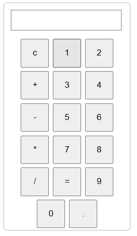

# 🔢 Simple Calculator App

A basic calculator web app built using **HTML, CSS, and JavaScript** that performs standard arithmetic operations such as:

- ➕ Addition  
- ➖ Subtraction  
- ✖️ Multiplication  
- ➗ Division  

---

## 🚀 Live Demo

👉 [Click here to try the Calculator](https://tanyav-rshney.github.io/Calculator/)

---

## 📸 Screenshot

---

## 🛠️ Tech Stack

- HTML5  
- CSS3  
- JavaScript (ES6)  
- GitHub Pages (for deployment)

---

## 🧠 What I Learned

- DOM manipulation using JS  
- Handling button events  
- Designing calculator layout with CSS  
- Hosting project using **GitHub Pages**  
- Fixing errors through debugging (trial & error 😄)

---

